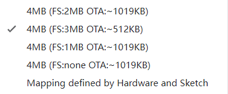

# ESPFS
It is designed to upload SPIFFS to the esp series microcontroller, and this method is temporarily used because the official plug-in is not supported by Arduino IDE 2.0 and above
=======
# ESPFS

## 1、使用方法
data文件夹下存放相关代码和静态资源（与Arduino IDE 1.x 保持一致）

示例为espFS.py 以及espFS.bat 推荐使用espFS.py 

需要设置参数！



根据烧录的代码分区，在board.txt寻找具体分区信息
example：
```
generic.menu.eesz.4M3M.build.spiffs_pagesize=256
generic.menu.eesz.4M3M.build.spiffs_start=0x100000
generic.menu.eesz.4M3M.build.spiffs_end=0x3FA000
generic.menu.eesz.4M3M.build.spiffs_blocksize=8192


spi_size=0x3FA000-0x100000          #FS:3MB(-24K)----spiffs_end-spiffs_start=3048*1024
page=256                            #spiffs_pagesize=256
block=8192                          #spiffs_blocksize=8192

#
port='com5'
baud=460800
FS_Start_Address=0x100000           #spiffs_start=0x100000
chip='esp8266'
```
修改关键参数到 espFS.py 后，修改串口号运行


可以使用批处理或者python方式执行，两者效果一样
核心命令：
```
py：
     run_cmd_Popen_fileno(f"mkspiffs.exe -c ./data -p 256 -b 8192 -s 0x2FA000 {binname}")
     run_cmd_Popen_fileno(f'esptool.exe --chip esp8266 --baud 115200 write_flash -z 0x100000 {binname}') 
bat：
    %~dp0mkspiffs -c %~dp0data -b 8192 -p 256 -s 0x2FA000 %~dp0%file_name%
    %~dp0esptool.exe --chip esp8266 --baud 115200 write_flash -z 0x100000 %~dp0%file_name%
```
可在文件中修改相关参数

## 2、旨在向esp系列单片机上传SPIFS，由于Arduino IDE 2.0 以上暂不支持官方插件暂时使用此方法。

## 3、分区文件见  ./board.txt  来源 C:\~~\Arduino15\packages\esp8266\hardware\esp8266\3.1.2\board.txt

## 4、 mkspiffs.exe来源：C:\~~\Arduino15\packages\esp8266\tools\mkspiffs

